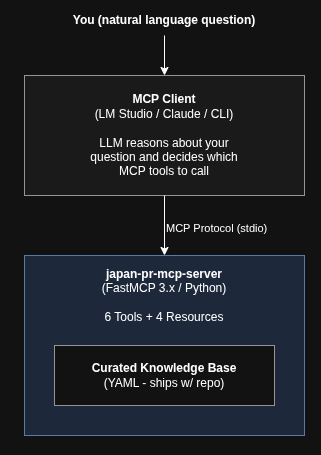

# Japan PR Navigator v2.0

**An MCP server that helps foreigners in Japan navigate the Permanent Residence application process using official government data and community insights.**

Ask natural language questions like:
- "What documents do I need for PR as a married HSP visa holder?"
- "How many HSP points do I have with a Master's degree, 8 years experience, and JLPT N2?"
- "What's the nearest immigration office to Yokohama?"
- "What are common mistakes people make in Phase 2?"

---

## Quick Start (6 Steps)

### Prerequisites

**For development and testing:**
- Python 3.11+
- [Git](https://git-scm.com) installed
- [GitHub CLI (`gh`)](https://cli.github.com) installed and authenticated (`gh auth login`)
- [MCP Inspector](https://github.com/modelcontextprotocol/inspector) (installed automatically via `fastmcp dev inspector`)

**For end-user chat experience (optional):**
- [Ollama](https://ollama.ai) — local LLM runtime
- An MCP-compatible client: [LM Studio](https://lmstudio.ai), [Claude Desktop](https://claude.ai/download), or [Claude Code](https://docs.anthropic.com/en/docs/claude-code)

### Step 0: Create the GitHub repository (maintainer only)

If you are setting up this project for the first time:

```bash
cd /path/to/japan-pr-navigator

git init
git add .
git commit -m "feat: initial project scaffold"

gh repo create japan-pr-navigator --public \
  --description "MCP server for Japan Permanent Residence application guidance" \
  --source . --push
```

### Step 1: Clone and install

```bash
git clone https://github.com/mgonzalezo/japan-pr-navigator.git
cd japan-pr-navigator
./scripts/setup.sh
```

The setup script creates a virtual environment, installs dependencies, validates the knowledge base, and runs all tests.

### Step 2: Test with the MCP Inspector

No LLM needed. Launch the interactive web inspector to test all tools and resources directly:

```bash
source .venv/bin/activate
PYTHONPATH=src DANGEROUSLY_OMIT_AUTH=true fastmcp dev inspector src/japan_pr_mcp/server.py:mcp
```

Open <http://localhost:6274> in your browser. You can call any tool, inspect inputs/outputs, and verify the server works. This is the recommended way to develop and debug.

### Step 3: (Optional) Pull a model via Ollama

Only needed if you want the full chat experience with an LLM:

```bash
# Recommended: Best Japanese + English understanding
ollama pull qwen2.5:14b

# Alternative: Lighter option (~4GB)
ollama pull llama3.1:8b
```

### Step 4: Configure your MCP client

**Option A: LM Studio (Recommended for end users)**

In LM Studio's MCP settings, add:

```json
{
  "japan-pr-navigator": {
    "command": "python",
    "args": ["-m", "japan_pr_mcp"],
    "cwd": "/path/to/japan-pr-navigator",
    "env": {
      "PYTHONPATH": "/path/to/japan-pr-navigator/src"
    }
  }
}
```

**Option B: Claude Desktop**

Add to `claude_desktop_config.json`:

```json
{
  "mcpServers": {
    "japan-pr-navigator": {
      "command": "python",
      "args": ["-m", "japan_pr_mcp"],
      "cwd": "/path/to/japan-pr-navigator",
      "env": {
        "PYTHONPATH": "/path/to/japan-pr-navigator/src"
      }
    }
  }
}
```

**Option C: Claude Code CLI**

Add to `~/.claude/mcp-configs/mcp-servers.json`:

```json
{
  "japan-pr-navigator": {
    "type": "stdio",
    "command": "python",
    "args": ["-m", "japan_pr_mcp"],
    "cwd": "/path/to/japan-pr-navigator",
    "env": {
      "PYTHONPATH": "/path/to/japan-pr-navigator/src"
    }
  }
}
```

### Step 5: Start asking questions

Open your MCP client and ask away:

```
> I'm a 35-year-old software engineer with a Master's degree, JLPT N2,
> 10 years of experience, and a salary of 9 million yen. Am I eligible
> for PR via the HSP fast track?
```

---

## Architecture



### Resource Efficiency

| Resource | Needed |
|----------|--------|
| Vector Database | No |
| Embedding Model | No |
| Redis/Cache | No |
| Running services | 1 (Ollama) |
| Disk (excluding model) | ~5MB |
| RAM overhead (server) | ~50MB |

---

## Available MCP Tools

| Tool | Description | Key Inputs |
|------|-------------|------------|
| `search_pr_requirements` | PR eligibility by visa type | `visa_type`, `marital_status` |
| `check_hsp_points` | HSP point calculator | `age`, `salary_jpy`, `education`, `experience_years`, `jlpt_level` |
| `get_document_checklist` | Personalized 28-doc checklist | `applicant_type` (single/married/with_children) |
| `lookup_immigration_office` | Find nearest office | `prefecture` or `city` |
| `search_linkedin_insights` | Community tips search | `query`, `category` |
| `get_phase_guidance` | Phase-by-phase guidance | `phase` (1-4) |

## MCP Resources

| URI | Description |
|-----|-------------|
| `knowledge://documents/{doc_id}` | Individual document details (bilingual) |
| `knowledge://phases/{phase_number}` | Phase walkthrough with tips |
| `knowledge://hsp/points-table` | Full HSP point calculation matrix |
| `knowledge://offices/{region}` | Immigration office details |

---

## Test Suite

78 tests with 95% coverage:

```bash
source .venv/bin/activate
pytest tests/ -v --cov=japan_pr_mcp --cov-report=term-missing
```

| Test File | Tests | Covers |
|-----------|-------|--------|
| `test_knowledge_base.py` | 20 | YAML loader, accessors, search |
| `test_tools_requirements.py` | 6 | PR requirement search |
| `test_tools_documents.py` | 8 | Document checklist filtering |
| `test_tools_hsp.py` | 10 | HSP point calculation |
| `test_tools_phases.py` | 7 | Phase guidance |
| `test_tools_offices.py` | 6 | Office lookup |
| `test_tools_linkedin.py` | 5 | Community insights search |
| `test_resources.py` | 7 | MCP resource handlers |
| `test_server_integration.py` | 9 | End-to-end MCP protocol |

---

## Knowledge Base (Community-Editable)

The knowledge base lives in `knowledge/` as YAML files. **You don't need to write code to contribute.**

| File | Contents |
|------|----------|
| `documents.yaml` | All 28 PR documents (EN/JP names, notes, applicant types) |
| `phases.yaml` | 4 application phases with steps, tips, common mistakes |
| `hsp_points.yaml` | HSP point calculation tables (education, salary, age, experience, JLPT) |
| `offices.yaml` | 10 immigration offices with addresses and wait time estimates |
| `tips.yaml` | Community-sourced tips by phase |
| `faq.yaml` | Frequently asked questions with sourced answers |

---

## Contributing

### No coding required

- Add tips to `knowledge/tips.yaml`
- Update office info in `knowledge/offices.yaml`
- Fix document requirements in `knowledge/documents.yaml`
- Add FAQ entries in `knowledge/faq.yaml`

### Code contributions

- Add MCP tools in `src/japan_pr_mcp/tools/`
- Improve tests in `tests/`
- Fix bugs

### PR Process

1. Fork the repository
2. Create a feature branch (`git checkout -b add-osaka-office-tips`)
3. Make your changes
4. Run tests (`source .venv/bin/activate && pytest tests/ -v`)
5. Submit a PR with a clear description

---

## Recommended LLM Models

| Model | Size | Best For |
|-------|------|----------|
| `qwen2.5:14b` | ~8.9GB | Best Japanese language understanding |
| `llama3.1:8b` | ~4.7GB | Quick answers, low-resource machines |
| `mistral:7b` | ~4.1GB | Good multilingual support |
| `gemma2:9b` | ~5.4GB | Balanced performance and size |

---

## License

MIT

## Disclaimer

This tool provides guidance based on publicly available information and community experiences. It is NOT legal advice. Always verify with your local Immigration Bureau or a qualified immigration lawyer (gyoseishoshi).
